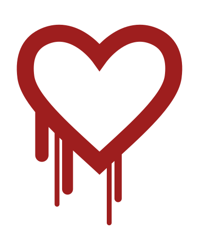
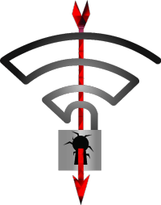
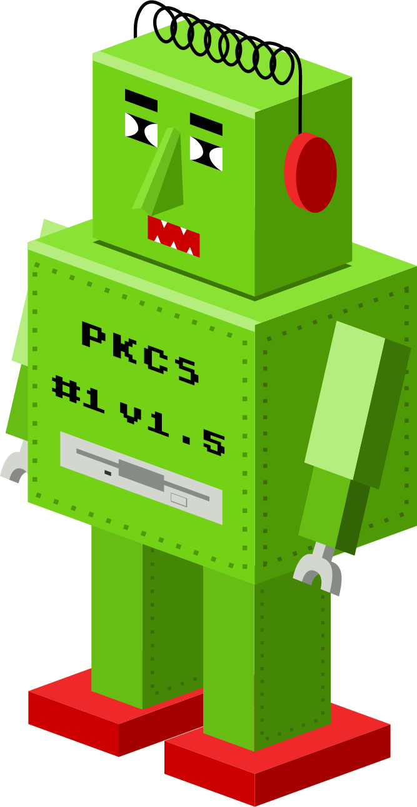

# Vulnerabilities and Attacks

Have vulnerabilities been used in real world attacks?

| Logo | Name | Year | Target | Description | Real attack? | Notes/Sources |
| :---: | :--- | :--- | :--- | :--- | :--- | :--- |
| - | [BEAST](https://www.youtube.com/watch?v=-BjpkHCeqU0) | 2011 | TLS 1.0 | Attacking implicit IV in CBC mode encryption | No | - |
| - | [CRIME](https://en.wikipedia.org/wiki/CRIME) | 2012 | TLS | TLS Compression leaks information | No | - |
|  | BREACH | 2013 | TLS | HTTP compression inside TLS leaks information | No | - |
| - | [TIME](https://www.youtube.com/watch?v=rTIpFfTp3-w) | 2013 | TLS | Compression attack with Javascript/TCP sidechannel | No | - |
|  | [Heartbleed](http://heartbleed.com/) | 2014 | OpenSSL | Buffer overread leaking server memory | Yes | [Reuters/Canadian tax agency](https://www.reuters.com/article/us-cybersecurity-heartbleed/heartbleed-blamed-in-attack-on-canada-tax-agency-more-expected-idUSBREA3D1PR20140414) [JPMorgan Hack](http://www.eweek.com/security/trio-indicted-in-massive-jpmorgan-hack) |
|  | [CCS Injection](http://ccsinjection.lepidum.co.jp/) | 2014 | OpenSSL | State machine confusion via early CCS | No | - |
|  | [Shellshock](https://en.wikipedia.org/wiki/Shellshock_(software_bug)) | 2014 | Bash | Remote code execution via variables | Yes | [Cloudflare/Exploits](https://blog.cloudflare.com/inside-shellshock/) |
| - | [Drupalgeddon](https://www.drupal.org/forum/newsletters/security-advisories-for-drupal-core/2014-10-15/sa-core-2014-005-drupal-core-sql) | 2014 | Drupal | SQL Injection leading to RCE | Yes | [Drupal/Automated attacks after 7h](https://www.drupal.org/forum/newsletters/security-public-service-announcements/2014-10-29/drupal-core-highly-critical) |
| - | [POODLE](https://www.openssl.org/~bodo/ssl-poodle.pdf) | 2014 | SSLv3 | Padding oracle with downgrade attack | No | - |
| - | [goto fail](https://www.imperialviolet.org/2014/02/22/applebug.html) | 2014 | Apple iOS | Typo in source code disabling TLS certificate verification | No | - |
| - | [GHOST](https://blog.qualys.com/laws-of-vulnerabilities/2015/01/27/the-ghost-vulnerability) | 2015 | Glibc | Buffer overflow via DNS | No | - |
| - | [FREAK](https://www.freakattack.com/) | 2015 | TLS | Downgrade to export ciphers | No | - |
| - | [Superfish](https://en.wikipedia.org/wiki/Superfish) | 2015 | Lenovo laptops | Bundled software with shared root certificate | No | - |
| - | [Rowhammer](https://googleprojectzero.blogspot.com/2015/03/exploiting-dram-rowhammer-bug-to-gain.html) | 2015 | DRAM | Bitflips in RAM modules | No | - |
| - | [Logjam](https://weakdh.org/) | 2015 | TLS | Weak diffie hellman parameters | No* | Speculation this may've been exploited by the NSA |
| - | [Stagefright](https://en.wikipedia.org/wiki/Stagefright_(bug)) | 2015 | Stagefright/Android | Memory corruption in media parsers | No | - |
|  | [VENOM](https://venom.crowdstrike.com/) | 2015 | QEMU | VM escape | No | - |
|  | [DROWN](https://drownattack.com/) | 2016 | TLS/SSLv2 | Bleichenbacher attack using SSLv2 | No | - |
|  | [Badlock](https://web.archive.org/web/20170608065927/http://badlock.org/) | 2016 | Samba/SMB | Various man in the middle attacks | No | - |
| - | [ImageTragick](https://imagetragick.com/) | 2016 | Imagemagick | Remote code execution in image parsers | Yes | [Cloudflare reporting attacks](https://blog.cloudflare.com/inside-imagetragick-the-real-payloads-being-used-to-hack-websites-2/) |
| - | [HEIST](https://tom.vg/papers/heist_blackhat2016.pdf) | 2016 | TLS | Compression attack with Javascript/TCP sidechannel | No | - |
|  | [Sweet32](https://sweet32.info/) | 2016 | TLS/3DES | Block collissions in 64 bit block ciphers | No | - |
|  | [Dirty COW](https://dirtycow.ninja/) | 2016 | Linux Kernel | Race condition leading to local root exploit | Yes | [ZDNet/Drupalgeddon2/DirtyCOW attacks](https://www.zdnet.com/article/hackers-use-drupalgeddon-2-and-dirty-cow-exploits-to-take-over-web-servers/) [TrendMicro/ZNIU Android Malware](https://blog.trendmicro.com/trendlabs-security-intelligence/zniu-first-android-malware-exploit-dirty-cow-vulnerability/) |
|  | [KRACK](https://www.krackattacks.com/) | 2017 | WPA2 | Nonce reuse in wireless encryption | No | - |
|  | [DUHK](https://duhkattack.com/) | 2017 | FortiOS | Hardcoded key in FIPS-certified X9.31 RNG | No | - |
|  | [ROBOT](https://robotattack.org/) | 2017 | TLS | Lack of Bleichenbacher attack countermeasures | No | - |
| - | [EternalBlue](https://en.wikipedia.org/wiki/EternalBlue) | 2017 | Windows/SMBv1 | Remote code exection via SMB | Yes | [WaPo/NSA use](https://www.washingtonpost.com/business/technology/nsa-officials-worried-about-the-day-its-potent-hacking-tool-would-get-loose-then-it-did/2017/05/16/50670b16-3978-11e7-a058-ddbb23c75d82_story.html?utm_term=.494c978e2f2e), [WannaCry](https://en.wikipedia.org/wiki/WannaCry_ransomware_attack), [NotPetya](https://en.wikipedia.org/wiki/Petya_(malware)) |
| - | [SambaCry](https://www.samba.org/samba/security/CVE-2017-7494.html) | 2017 | Samba | RCE via Samba shares | Yes | [Kaspersky/Honeypot attacks](https://securelist.com/sambacry-is-coming/78674/) |
|  | [Meltdown](https://meltdownattack.com/) | 2018 | CPU/OS | Speculative execution sidechannel attacking root/user barrier | No | - |
|  | [Spectre](https://spectreattack.com/) | 2018 | CPU/OS | Speculative execution sidechannel attacking program flow | No | - |
| - | [Drupalgeddon 2](https://www.drupal.org/sa-core-2018-002) | 2018 | Drupal | Remote code execution | Yes | [ZDNet/Drupalgeddon2/DirtyCOW attacks](https://www.zdnet.com/article/hackers-use-drupalgeddon-2-and-dirty-cow-exploits-to-take-over-web-servers/) |
|  | [EFAIL](https://efail.de/) | 2018 | OpenPGP/SMIME | Exfiltrate decrypted mails with HTML | No | - |
| - | [Bleichenbacher's CAT](http://cat.eyalro.net/) | 2018 | TLS | Lack of Bleichenbacher attack countermeasures | No | - |

FAQ
===

What?
-----

I'm wondering how many of the "famous" security vulnerabilities have actually been used in attacks that
have been documented, so I made a list.

Couldn't there be unknown attacks?
----------------------------------

Obviously this list can only cover attacks that have been publicly documented, particularly targetted
attacks or attacks within communities with low transparency.

Still if attacks have been widely used it's reasonable to assume that someone will have documented them.

The table is wrong! Attack X has been used!
-------------------------------------------

Please open an issue or a pull request. I created this repo to learn whether my assumptions are correct.

What counts as a real world attack?
-----------------------------------

I realize the distinction can be blurry, but it should be an attack that has been carried out without
the consent of the owner of the affected system and it should've successfully compromised some security
expectation.

Also there should be at least one publicly available description with sufficient detail to make the attack
plausible, not just vague rumors.

There's an important attack missing!
------------------------------------

Open an issue or a pull request, but I may close it if I believe the attack hasn't received sufficient
attention or is a pure marketing stunt.

There's a logo missing!
-----------------------

Likely due to unclear licensing terms. All logos used here are under free licenses.

Copyright
=========

The document and most logos are CC0 / public domain, with [some exceptions](LICENSE.md).
